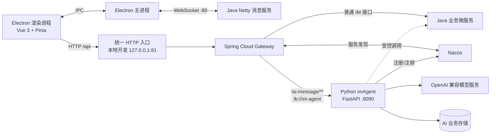
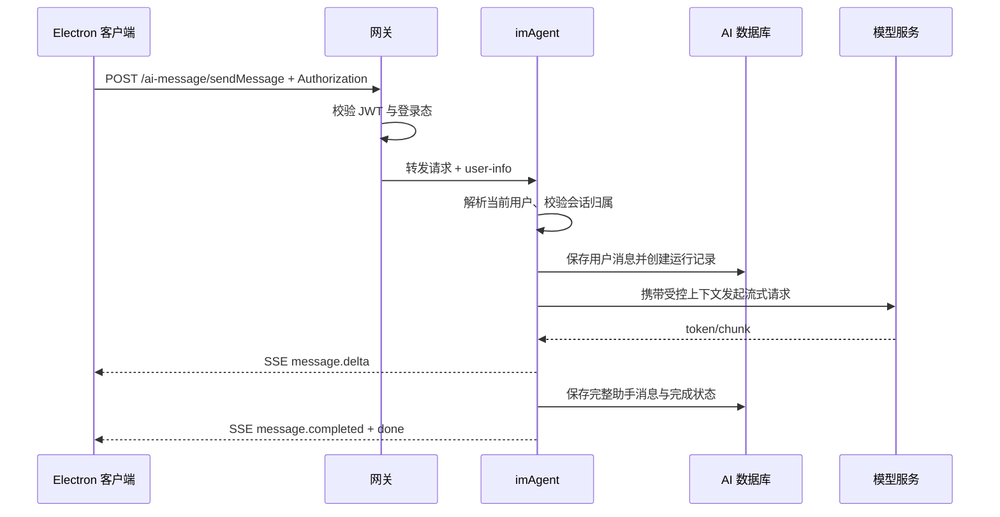
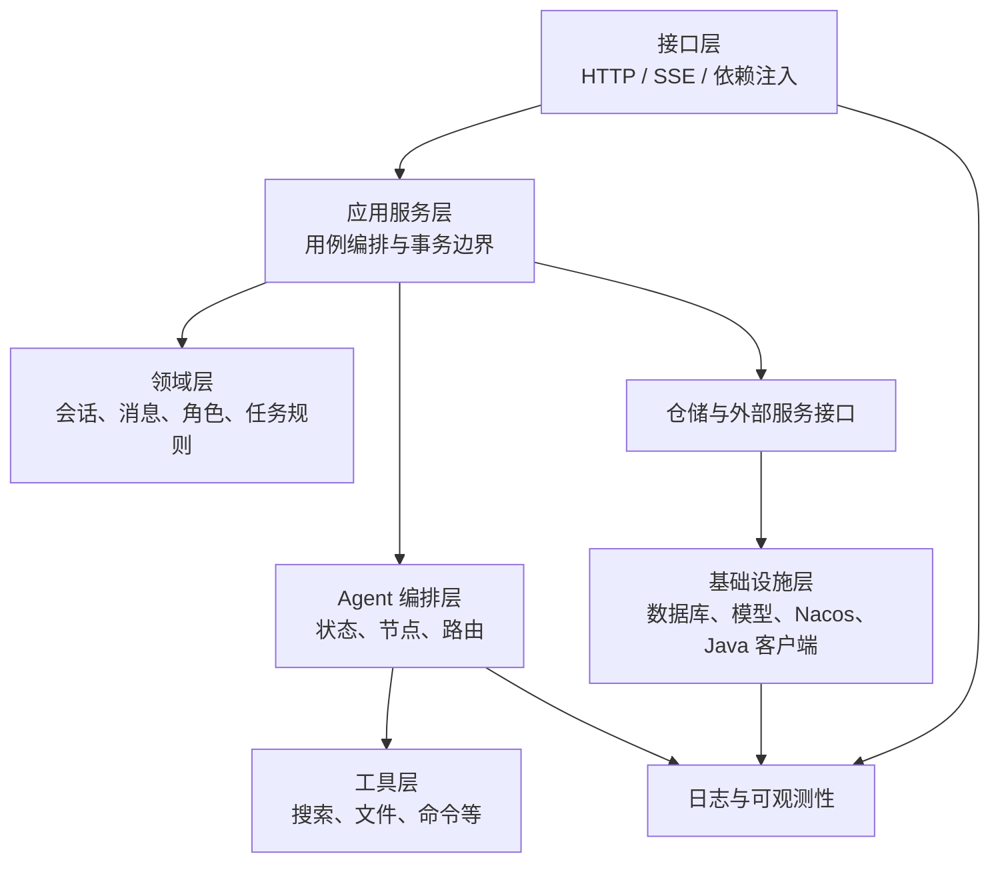

# 系统总体架构

## 1. 当前系统关系



当前前端的普通聊天继续使用 WebSocket 自定义二进制协议；AI 对话使用 HTTP + SSE。两条链路用途不同，不应为了“统一”而强行合并。

## 2. 一次 AI 请求的推荐流程



异常时也必须结束运行状态：客户端断开、模型超时、工具失败不能让任务永久停留在“运行中”。

## 3. imAgent 内部分层



各层职责：

- 接口层：解析请求、恢复用户身份、输出 SSE，不承载业务流程；
- 应用服务层：组织一次用例，例如“发送消息并持久化回复”；
- 领域层：表达会话归属、消息角色、运行状态等稳定规则；
- Agent 编排层：管理状态和节点，不直接依赖 FastAPI 的 Request；
- 工具层：只暴露经过校验的有限能力；
- 基础设施层：封装模型、数据库、Nacos 与其他微服务；
- 可观测性：贯穿请求、模型调用和工具执行。

## 4. 模型调用架构

不要让每个业务服务自行创建模型对象。推荐集中为一个模型网关组件：

```text
业务用例 -> Agent/Chain -> 模型网关 -> ChatOpenAI/OpenAI 兼容接口
                              ├─ 超时
                              ├─ 重试策略
                              ├─ 并发限制
                              ├─ token/用量记录
                              └─ 供应商错误归一化
```

当前 `create_llm()` 可以作为起点，但后续应由依赖注入复用客户端，避免每次请求重复构造且难以测试。

## 5. 会话、运行与消息模型

建议区分三个概念：

| 概念 | 含义 | 典型状态 |
|---|---|---|
| 会话 Conversation | 用户长期可见的聊天容器 | active、archived |
| 运行 Run | 一次用户请求触发的 Agent 执行 | queued、running、completed、failed、cancelled |
| 消息 Message | 会话中用户、助手或工具产生的内容 | streaming、completed、failed |

这样可以支持取消、重试、工具审批和失败恢复，而不需要把所有状态塞进消息对象。

## 6. 数据存储建议

第一阶段只引入必要组件：

| 数据 | 推荐存储 | 说明 |
|---|---|---|
| 会话、消息、角色、运行记录 | MySQL | 与现有部署体系一致 |
| 短期运行态、取消标记、限流计数 | Redis | 确有跨实例需求时再接入 |
| 头像、用户附件、生成文件 | 现有 MinIO | 复用现有文件能力 |
| Agent 图 checkpoint | MySQL/PostgreSQL 对应实现或 Redis | 开始做可恢复工作流时再引入 |
| 向量记忆 | 暂不建设 | 第三阶段单独选型 |

不要在第一阶段仅为“以后可能需要”同时引入消息队列、向量数据库和多个缓存系统。

## 7. 部署与扩缩容

- 每个 imAgent 实例以相同 `service_name=im-agent` 注册到 Nacos；
- 网关通过 `lb://im-agent` 发现实例；
- 健康检查应区分“进程存活”和“依赖可用”；
- 服务实例尽量无状态，运行状态放入共享存储后才能安全水平扩容；
- SSE 连接时间较长，需要同步检查网关、反向代理和客户端的读取超时；
- 应配置优雅停机：停止接收新请求，结束或标记现有运行，再从 Nacos 注销。

## 8. 可观测性最小集合

每次请求至少记录：

- `request_id`；
- `user_id`（日志中按需要脱敏）；
- `conversation_id`；
- `run_id`；
- 模型名称；
- 首 token 延迟、总耗时；
- 输入/输出 token 数；
- 工具名称、执行耗时与结果状态；
- 错误码，不记录 API Key、完整令牌和敏感文件内容。
